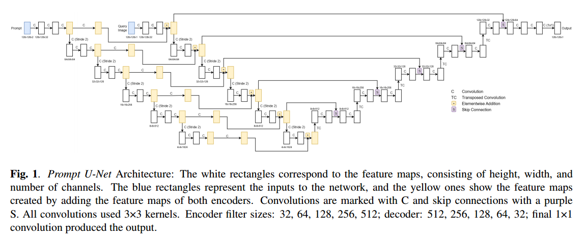
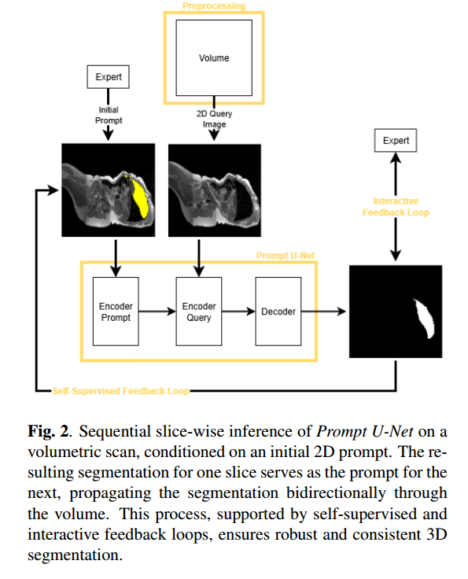

# Prompt U-Net: Clinician-Guided AI for Context-Aware Segmentation

[](https://www.nora-imaging.com/)
[](docs/p_unet_preprint_outdated.pdf)

> **"A leap towards generalizable, lightweight, and user-controllable AI in clinical workflows."**

Welcome to the code repository for **Prompt U-Net**, an interactive machine learning model for medical image segmentation based on prompts. **Here, you can build, train, and evaluate the model yourself.**

If you simply want to try the model **without any installation or setup problems**, our interactive demo can be used directly in your browser via [Nora Imaging](https://www.nora-imaging.com/).

---

## 🚀 Interactive Demo & Clinical Accessibility

To bridge the gap between research and clinical application, the model is highly optimized and deployed using TensorFlow.js. We demonstrate that, compared to resource-intensive models, high-fidelity segmentation can be achieved locally on standard consumer hardware.

**Why this matters for Clinicians/Researchers:**
1. **Zero-Setup:** No Python/Docker/GPU drivers needed. Works instantly in any browser via Nora Imaging.
2. **Data Privacy:** Full **client-side inference**. Medical data never leaves the local machine.
3. **In-context learning:** Perfect for real-time interaction during imaging or screening.

### Watch the Demo or Try it Yourself
- **YouTube Demo:** [Watch our one-minute demo video](https://youtu.be/pYGCIfeopFA)
- **Interactive Demo:** Use it yourself on your device inside [Nora Imaging](https://www.nora-imaging.com/)
  - **Currently uses Prompt U-Net V21, which is intended solely for MRI segmentation and is slower than the latest version.**
  - [Nora Imaging Documentation](https://www.nora-imaging.org/doc)
  1. Press 'M' to memorize the segmentation you made.
  2. Press 'N' on another slice of the same axis to create a segmentation.
  3. Proceed if the result meets your expectations. If not, edit it and memorize it.

---

## 💡 Scientific Core Innovation & Features

Prompt U-Net transforms static segmentation into an **interactive, context-aware process**. Unlike "black-box" models, it leverages **In-Context Learning** to adapt to unseen anatomical structures using minimal data, while outperforming important baseline models with significantly lower computational complexity and memory footprint.

**Features:**
- **Dual-Encoder Architecture:** Simultaneously processes a medical image and a 2D user-provided prompt, with a dedicated conditioning mechanism.
- **In-Context Learning:** Enables rapid adaptation to new tasks without retraining.
- **Self-Supervised Feedback (SSF):** Automatically ensures volumetric consistency. The model uses its own predictions from adjacent slices as internal "context" to refine the current segmentation without human intervention *(not yet in Browser Demo)*.
- **Interactive Feedback (IF):** Enables "Human-in-the-loop" refinement. A clinician can provide a manual correction on a missegmented area, which is instantly used to update and improve future masks.
- **Data Efficiency:** Outperforms established baselines with reduced data requirements.

<br>


<br>

---

## 🛠️ Code Repository & Getting Started

This repository structure emphasizes modularity, clearly separating data loading, training pipelines, model architecture, evaluation baselines, and web deployment.

### 1. Clone the repository:
```bash
git clone https://github.com/Machauer-P/prompt-unet
cd prompt-unet
```

### 2. Set up a virtual environment:
```bash
python -m venv .venv
# On Linux/macOS:
source .venv/bin/activate  
# On Windows:
.venv\Scripts\activate
```

### 3. Install dependencies:
For core ML, data processing, and training, install the default requirements:
```bash
pip install -r requirements.txt
```
If you plan to run evaluations against external benchmark models (like **nnInteractive** or **UniverSeg**), which require PyTorch and specific evaluation libraries, use:
```bash
pip install -r requirements_eval.txt
```

---

## 📂 Project Structure

- **`data/`**: Core dataset processing scripts and data loaders (e.g., `DataGenerator.py`, `DataLoader_npz.py`). Contains Jupyter notebooks to explore data augmentations and outputs.
- **`models/`**: Neural network architecture and related definitions (`prompt_unet.py`) and custom optimizers.
- **`training/`**: The main hub for training Prompt U-Net, containing Jupyter Notebooks (e.g., `p_unet_*.ipynb`) and storage for `.keras` models.
- **`utils/`**: Reusable modules for preprocessing, augmentation, measuring performance (metrics), and visualization.
- **`evaluation/`**: Scripts and data configurations for benchmarking tests against baselines like nnInteractive and UniverSeg.
- **`deployment/`**: Web-based deployment tools, including the interactive TensorFlow.js demonstration and model conversion scripts (`keras_to_tf_js.py`).

---

## 📖 How to Use the Code

### 1. Training a Model
To train a brand new model or continue training, navigate to the `training/` directory. Open the latest notebook (e.g., `p_unet_292.ipynb`). Ensure your data is correctly populated in `data/train_data/`. The notebooks are designed interactively to configure hyperparameters, instantiate the model via `models/prompt_unet.py`, load data using generators from `data/`, and run training loops.

### 2. Evaluating Models
Once you have trained your Prompt U-Net, you can assess its performance. Ensure you have installed the dependencies via `requirements_eval.txt`. Check the folders inside `evaluation/` for specific run instructions depending on the chosen benchmark.

### 3. Deploying to the Web
To demonstrate the model's capabilities:
1. Export your `.keras` model using the `deployment/keras_to_tf_js.py` converter.
2. The UI code inside `deployment/` (HTML, JS, CSS) provides an interactive canvas to draw prompts and see real-time inference using TensorFlow JS.
3. Simply serve the `deployment/` folder with an HTTP server, e.g., `python -m http.server 8000`, and navigate to `localhost:8000` in your web browser.

---

## 🔬 Technical Documentation & Publication

For an in-depth discussion, please refer to our preprint on version 21 of the Prompt U-Net:

**[Read Preprint](docs/p_unet_preprint_outdated.pdf)**

> **Note on Project Evolution:** 
> This codebase is under active development. While the preprint provides the foundational scientific framework, the current implementation has evolved further. The future publication will include architectural refinements and further research, for example into computational complexity and memory footprint.
