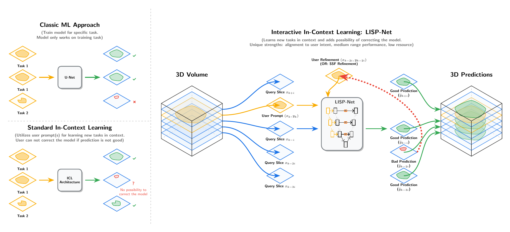

# LISP-Net (Lightweight In-Context Slice Propagator Network)

> The codebase uses the working name `prompt_unet` for internal identifiers — this is the same model.

[](https://www.nora-imaging.com/)
[](docs/p_unet_preprint_outdated.pdf)
[](https://huggingface.co/Machauer-P/lisp-net)

LISP-Net is a lightweight, purely convolutional framework optimized for interactive volumetric medical image segmentation. Rather than relying on sparse clicks, the model uses a single, dense 2D prompt — a reference image paired with a full segmentation mask — to derive structural guidance directly from the individual patient. The approach utilizes an asymmetrical dual-encoder architecture with multi-resolution conditioning, an adaptive tiling strategy, and a Self-Supervised Feedback (SSF) mechanism to automatically detect and mitigate structural drift during 3D propagation. The model is built with TensorFlow/Keras 3 and deployed via ONNX in-browser at [Nora Imaging](https://www.nora-imaging.com/). Pre-trained weights are available on [Hugging Face](https://huggingface.co/Machauer-P/lisp-net) as `.keras` and `.onnx`.

If you simply want to try the model **without any installation or setup**, our interactive demo runs directly in your browser — no Python, no GPU, no Docker required.

### Watch the Demo or Try it Yourself
- **YouTube Demo:** [Watch our demo video](https://www.youtube.com/watch?v=DFkN3o8yA4w)
- **Interactive Demo:** Use it yourself at [Nora Imaging](https://www.nora-imaging.com/)
  - Read the [Nora Imaging Documentation](https://reisertm.github.io/noradoc/chapters/segmentation-assistant-lisp-net.html) first

<br>


*Overview of segmentation paradigms.* **(Upper left)** *Classic supervised ML trains a fixed model per task and fails on unseen tasks.* **(Lower left)** *Standard in-context learning uses prompts to define new tasks but offers no correction mechanism.* **(Right)** *LISP-Net combines interactive ICL with a single dense 2D prompt. Within-volume visual correspondence propagates the user's annotation with strong alignment to the user's intent and high accuracy over medium-range offsets. Structural drift is handled automatically by SSF or manually by the user, both of which refresh the prompt context.*
<br>

---

## 🚀 Interactive Demo & Clinical Accessibility

To bridge the gap between research and clinical application, LISP-Net is deployed via ONNX and runs entirely client-side in the browser — no server round-trips, no data leaving the machine. In the native Python inference pipeline, peak GPU memory consumption is 164–362 MB, with per-slice latency of approximately 14 ms on GPU and 150 ms on CPU.

**Why this matters for Clinicians/Researchers:**
1. **Zero-Setup:** No Python, Docker, or GPU drivers needed. Works instantly in any browser via Nora Imaging.
2. **Data Privacy:** Full **client-side inference**. Medical data never leaves the local machine.
3. **Prompt-Driven Control:** A single dense 2D prompt defines the target — the model follows the user's annotation intent rather than defaulting to memorized anatomical priors.

---

## 💡 Core Innovation & Features

LISP-Net is a **purely convolutional framework** for interactive volumetric segmentation. Instead of sparse clicks, it conditions on a single dense 2D anchor prompt and propagates the annotation intent through within-volume visual correspondence rather than memorized anatomical priors. In 2D benchmarks it outperforms UniverSeg by 23.73% at mid-range offsets; in 3D it exceeds nnInteractive by 8.52% in volumetric Dice under simulated user interaction, with further advantages on out-of-distribution data.

**Key Contributions:**
- **Asymmetrical Dual-Encoder:** A heavy Prompt Encoder extracts structural semantics from a dense 2D prompt (reference image + full mask). Multi-resolution SE channel-attention fuses these features into the Query Encoder at each stage.
- **Efficient & Lightweight:** ~28M parameters, adaptive tiling, peak GPU memory of 164–362 MB, per-slice latency of ~14 ms (GPU) / ~150 ms (CPU). Runs client-side in standard web browsers on consumer hardware.
- **Self-Supervised Feedback (SSF):** Automatically detects structural drift during 3D propagation via confidence monitoring and refreshes the prompt context without ground-truth annotations.
- **Interactive Feedback (IFL):** A clinician corrects a missegmented slice; it becomes a fresh dense prompt to update all subsequent predictions.
- **Out-of-Distribution Robustness:** An MRI-only variant retains accuracy on CT; a head-only variant segments body anatomy. The model follows the prompt, not the training prior.

<br>

<br>

---

## 🛠️ Getting Started

### 1. Clone the repository:
```bash
git clone https://github.com/Machauer-P/lisp-net
cd lisp-net
```

### 2. Set up a virtual environment:
```bash
python -m venv .venv
# On Linux/macOS:
source .venv/bin/activate
# On Windows:
.venv\Scripts\activate
```

### 3. Install dependencies:
For core ML, training, and inference:
```bash
pip install -r requirements.txt
```
For evaluation against external benchmarks (nnInteractive, UniverSeg — requires PyTorch):
```bash
pip install -r requirements_eval.txt
```

---

## 📂 Project Structure

```
.
├── data/                       # Data loading, preprocessing & dataset generation
│   ├── DataLoader_npz.py       # Loads NPZ files into RAM, provides dataset dict to DataGenerator
│   ├── DataGenerator.py        # Samples patches, z-score normalization, label-guided 128×128 cropping
│   ├── train_data/             # Scripts to convert raw medical data → training NPZ files
│   └── test_data/              # Scripts to convert raw medical data → test NPZ files
│
├── training/                   # Model definitions & training scripts
│   ├── prompt_unet.py          # Current model architecture definition
│   ├── train_332.py            # Final benchmark training script (v332)
│   ├── optimizer.py            # WarmupFlatCosineDecay LR schedule
│   ├── augmentations.py        # Photometric, geometric & morphological augmentations
│   └── CHANGELOG.md            # Full model version history (v21 → v340)
│
├── inference/                  # Prediction pipeline & post-processing
│   ├── predictor.py            # PromptUNetPredictor (direct 128×128 + tiling paths)
│   ├── tiling.py               # TiledInference for arbitrary-resolution slices
│   ├── inference_volume.py     # VolumeInference, SSF, and IFL orchestration
│   ├── ssf.py                  # Self-Supervised Feedback strategies
│   └── tune_ssf.py             # SSF hyperparameter tuning on training data
│
├── evaluation/                 # Benchmarks against UniverSeg (2D) & nnInteractive (3D)
│   ├── README.md               # Evaluation setup & instructions
│   ├── benchmark_universeg/    # 2D comparison pipeline & results
│   └── benchmark_nninteractive/# 3D comparison pipeline & results
│
├── deployment/                 # ONNX export & basic integration test
│   ├── keras_to_onnx.py        # Export .keras → ONNX
│   ├── benchmark.html          # ONNX vs. TF.js correctness check (testing only)
│   ├── index.html              # Minimal browser demo (testing only — not a medical viewer)
│   ├── script.js               # ONNX inference engine & canvas interaction
│   └── style.css               # Demo UI styling
│
├── utils/                      # Shared utilities
│   ├── preprocessing.py        # Normalization, resampling helpers
│   ├── cropping.py             # Patch extraction utilities
│   ├── metrics.py              # Dice, IoU, and other segmentation metrics
│   ├── visualization.py        # Plotting and result visualization
│   ├── model_loading.py        # Model loading with Keras 3 serialization workarounds
│   └── resampling.py           # Volume resampling utilities
│
├── docs/                       # Architecture diagrams, preprint, and documentation
├── requirements.txt            # Core dependencies (TF 2.21, Keras 3, NumPy, etc.)
└── requirements_eval.txt       # Core dependencies + Evaluation dependencies (PyTorch, nnUNet, UniverSeg)
```

---

## 📖 How to Use the Code

### 1. Training a Model

To train the final benchmark model (v332):

```bash
python training/train_332.py
```

The training script uses:
- **Architecture:** `training/prompt_unet.py` — dual-encoder U-Net with SE attention on prompt skip connections, pure Conv2D, filter schedule `[48, 96, 192, 256, 384]` (~28M params).
- **Data pipeline:** `data/DataLoader_npz.py` loads NPZ files into RAM and provides the dataset dict. `data/DataGenerator.py` takes a DataLoader as input and samples prompt-query pairs with z-score normalization and label-guided 128×128 patch cropping. Augmentations are applied separately via `training/augmentations.py`.
- **LR schedule:** `WarmupFlatCosineDecay` (50 ep warmup → 1500 ep flat → cosine decay to epoch 4000).
- **Loss:** Binary cross-entropy.
- **Training data:** 208 volumes across 7 datasets (NAKO, TotalSegmentator, MSD, BraTS-GLI, BraTS-MEN-RT, TopCoW MR, TopCoW CT), stored as NPZ files in `data/train_data/`.

Training loops are custom (not `model.fit()`), using `tf.GradientTape` with periodic MLflow logging.

### 2. Running Inference

Once trained, use the modules in `inference/`:

```python
from inference.predictor import PromptUNetPredictor
predictor = PromptUNetPredictor("training/p_unet_332.keras")
mask = predictor.predict(query_image, prompt)
```

Two prediction paths are available:
- **Direct 128×128:** Fast batched forward pass for standard-resolution inputs.
- **Tiling:** Adaptive tiling via `TiledInference` for arbitrary-resolution slices (matches the JS implementation in `deployment/script.js`).

For 3D volumes, use `inference/inference_volume.py` which orchestrates slice-by-slice prediction with optional SSF (Self-Supervised Feedback) and IFL (Interactive Feedback Loop).

SSF strategies in `inference/ssf.py` include `RelativeSSIMStrategy`, `MaskDiceStrategy`, and `ConfidenceDropStrategy`.

### 3. Evaluating Models

Ensure evaluation dependencies are installed (`pip install -r requirements_eval.txt`). See [evaluation/README.md](evaluation/README.md) for benchmark model setup instructions.

**2D Benchmark (LISP-Net vs UniverSeg):**
```bash
python evaluation/benchmark_universeg/eval_pipeline_2d.py --data_path <path>
```

**3D Benchmark (LISP-Net vs nnInteractive):**
```bash
python evaluation/benchmark_nninteractive/benchmark_3d.py --data <path> --model <path>
```

Complexity benchmarks (parameter count, FLOPs, speed) are in Jupyter notebooks under `evaluation/benchmark_universeg/` and `evaluation/benchmark_nninteractive/`.

### 4. Exporting for Deployment

The `deployment/` folder provides scripts to export a trained `.keras` model to ONNX. The accompanying HTML/JS/CSS files are a minimal test harness to verify the export works correctly — they are **not** a medical image viewer.

```bash
python deployment/keras_to_onnx.py training/p_unet_332.keras
```

To verify the export locally:
```bash
cd deployment && python -m http.server 8000
```

> Use these exports to integrate LISP-Net into your own medical imaging application. For a complete, production-ready integration with a full 3D viewer and interactive context management, see [Nora Imaging](https://www.nora-imaging.com/).

---

## ⚠️ Known Issues

- **Keras 3 serialization bug:** `.keras` files saved by TF 2.21 contain `renorm`/`quantization_config` keys in layer configs that Keras 3 rejects on load. Fixed in `inference/predictor.py` via JSON config patching.
